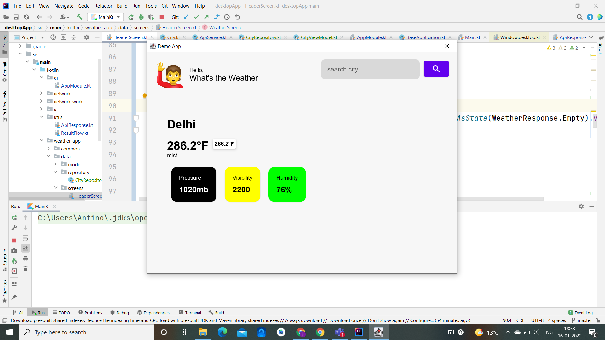

# Jetpack-Compose-Desktop-App

We can make desktop application through desktop-compose. it is same , as we used in  native development.

- update the intellij idea upto latest version

- select New project -> kotlin -> compose desktop

